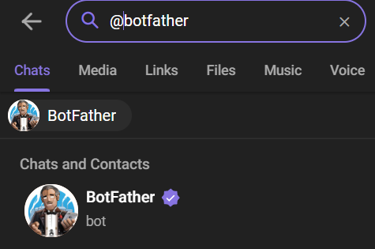
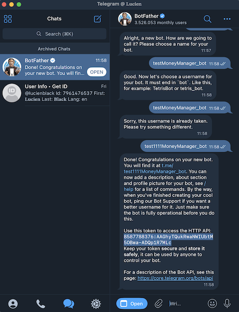
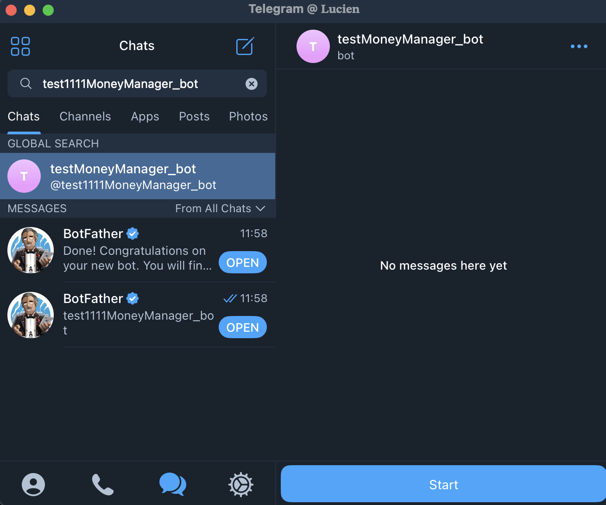
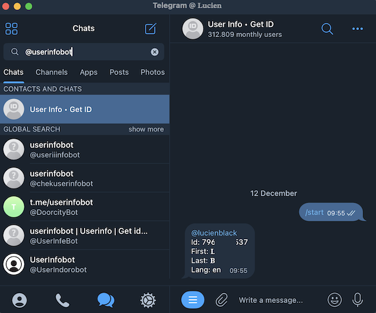
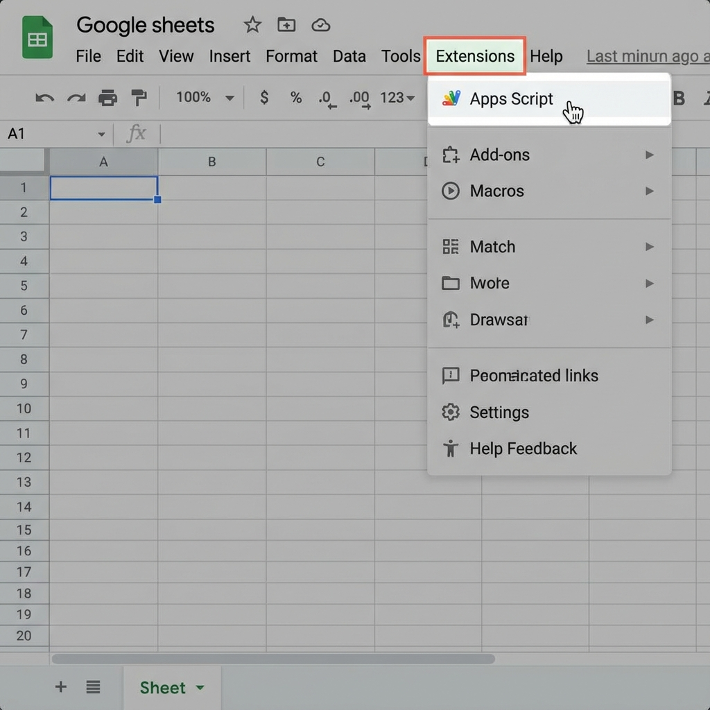
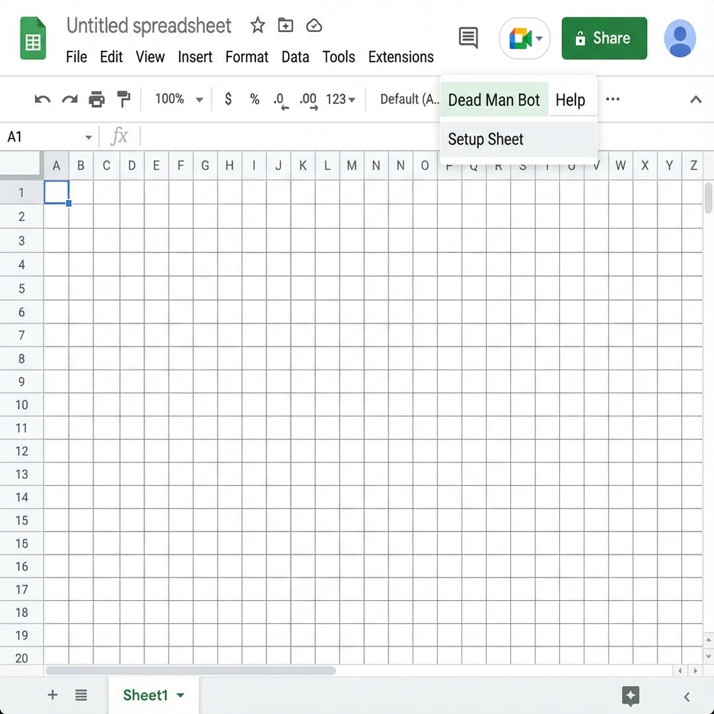
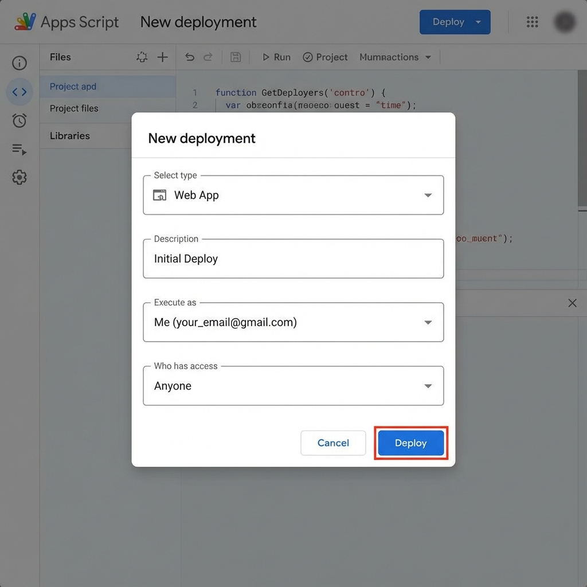
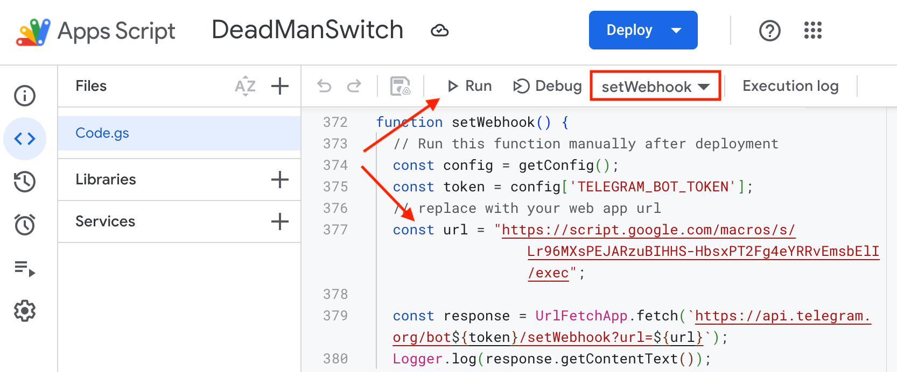
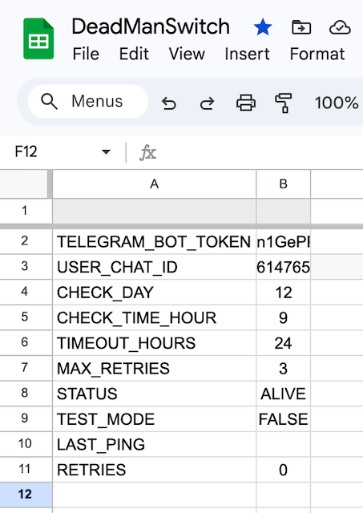
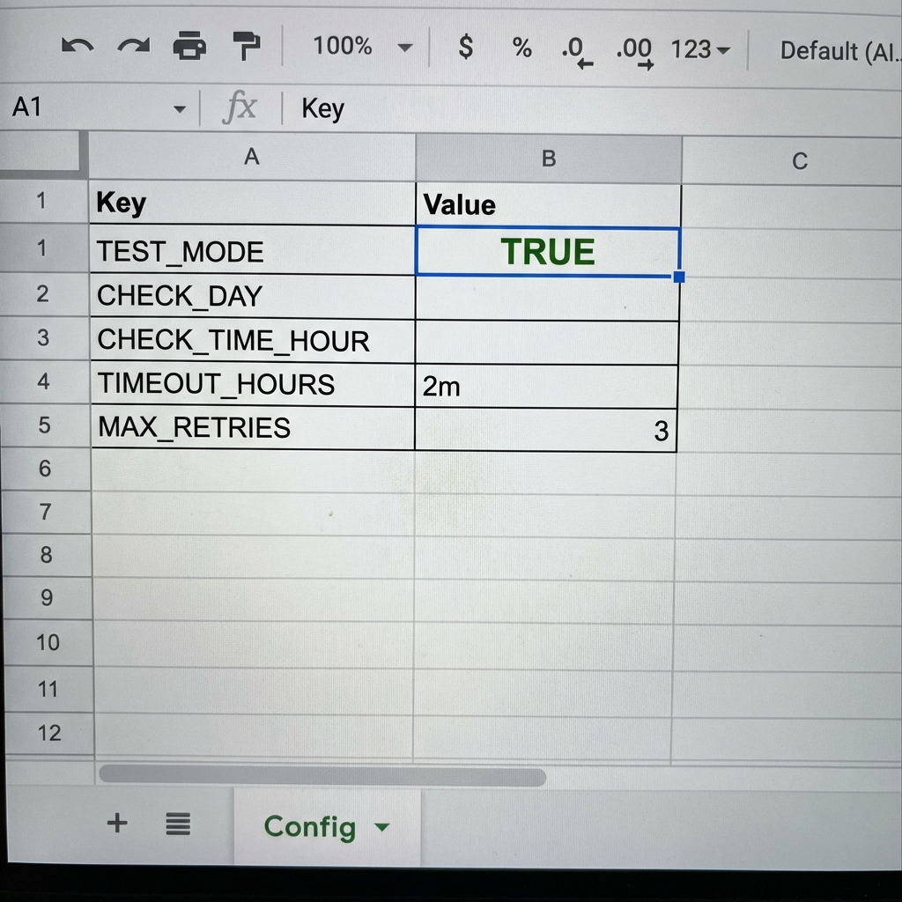

# Dead Man Switch Bot - Hướng dẫn Cài đặt

[🇺🇸 English Version](README.md)

Hệ thống này đảm bảo thông tin thừa kế của bạn sẽ được gửi đến người thụ hưởng nếu bạn ngừng phản hồi bot.

## 1. Cài đặt Telegram Bot
1.  Chat với **@BotFather** trên Telegram.
    
2.  Gửi lệnh `/newbot` và làm theo hướng dẫn để lấy **Bot Token**.
    
3.  Tìm bot mới tạo của bạn và bấm **Start**.
    

4.  Lấy **Chat ID** của bạn (bạn có thể dùng @userinfobot hoặc xem log sau này).

    

## 2. Cài đặt Google Sheet
1.  Tạo một Google Sheet mới, trống.
2.  Script sẽ tự động tạo các sheet và cột cần thiết ở bước sau.

    

## 3. Triển khai Script
1.  Mở **Extensions (Tiện ích mở rộng) > Apps Script**.
    
    

2.  Copy toàn bộ code từ file `src/Code.gs` trong thư mục này vào trình soạn thảo script.
3.  **Chạy Cài đặt**:
    *   Reload (F5) lại trang Google Sheet.
    *   Bạn sẽ thấy menu **"Dead Man Bot"** xuất hiện trên thanh công cụ (sau vài giây).
    *   Bấm **Dead Man Bot > Setup Sheet**.
    *   Script sẽ tự động tạo sheet "Config" và "Beneficiaries" cùng định dạng cần thiết.
    
    

4.  **Deploy (Triển khai)**:
    *   Bấm **Deploy > New Deployment**.
    *   Select type: **Web App**.
    *   Execute as: **Me (Tôi)**.
    *   Who has access: **Anyone (Bất kỳ ai)**.
    
    

5.  Copy **Web App URL**.
6.  Chạy hàm `setWebhook()` (thay thế `YOUR_WEB_APP_URL` trong code bằng URL vừa copy, hoặc hardcode tạm để chạy setup).

    

## 4. Cài đặt Trigger (Bắt buộc)
Để bot tự động chạy, bạn phải cài đặt Trigger theo đúng hướng dẫn sau:

1.  Trong giao diện Apps Script, bấm vào menu **Triggers** (biểu tượng đồng hồ bên trái).
2.  Bấm **+ Add Trigger** (góc dưới bên phải).
3.  Cấu hình như sau:
    *   Choose which function to run: `mainJob`
    *   Select event source: **Time-driven**
    *   Select type of time based trigger: **Hour timer**
    *   Select hour interval: **Every hour**
4.  Bấm **Save**.

> [!NOTE]
> Bạn phải chọn **Every hour (Mỗi giờ)** ngay cả khi bạn cấu hình kiểm tra theo tháng. Script sẽ tự động kiểm tra xem hôm nay có phải là ngày cần chạy không. Nếu bạn chọn timer khác, bot có thể sẽ không chạy đúng giờ cấu hình.

### Tùy chọn Tiết kiệm Trigger (Nâng cao)
Nếu bạn chỉ dùng cấu hình **Kiểm tra theo Tháng/Tuần** (thời gian chờ lâu) và muốn tiết kiệm số lần chạy của Script, bạn có thể chọn:
*   Select type of time based trigger: **Day timer**
*   Select time of day: **9am to 10am** (Hoặc khung giờ trùng với `CHECK_TIME_HOUR` của bạn)

**Lưu ý:** Cách này **CHỈ** dùng được nếu `TIMEOUT_HOURS` của bạn là đơn vị Ngày (d) hoặc Tuần (w). Nếu bạn set timeout ngắn (ví dụ 30 phút), cách này sẽ làm bot bị trễ thông báo.

## 5. Sử dụng & Cấu hình
Trong Sheet "Config", bạn có thể tùy chỉnh:

*   **CHECK_DAY**: (Tùy chọn) Nhập ngày (1-31) để chỉ kiểm tra vào ngày đó trong tháng. Để trống để kiểm tra hàng ngày.
*   **CHECK_TIME_HOUR**: Giờ (0-23) bot sẽ gửi tin nhắn kiểm tra.
*   **TIMEOUT_HOURS**: Thời gian chờ phản hồi. Hỗ trợ:
    *   `1w` (1 tuần)
    *   `3d` (3 ngày)
    *   `9h` (9 giờ)
    *   `30m` (30 phút)
    *   Mặc định là giờ nếu không có đơn vị.
*   **MAX_RETRIES**: Số lần nhắc nhở trước khi tuyên bố DEAD (Đã mất).

### Các Ví dụ Cấu hình

#### 1. Kiểm tra Hàng tháng, Nhắc nhở Hàng tuần (Yêu cầu phổ biến)
*   **CHECK_DAY**: `1` (Kiểm tra vào ngày mùng 1 hàng tháng)
*   **CHECK_TIME_HOUR**: `9` (lúc 9 giờ sáng)
*   **TIMEOUT_HOURS**: `1w` (Nếu không trả lời, đợi 7 ngày sau mới nhắc lại)
*   **MAX_RETRIES**: `3` (Nhắc 3 lần = 3 tuần dây dưa)

#### 2. Kiểm tra Hàng ngày
*   **CHECK_DAY**: (Để trống)
*   **TIMEOUT_HOURS**: `24`

#### 3. Chế độ Test (Chạy thử nhanh)
Mục đích: Kiểm tra xem bot có hoạt động, gửi tin nhắn và gửi email đúng không mà không cần chờ cả tuần.

*   **Cấu hình Sheet**:
    *   **TEST_MODE**: `TRUE` (Bỏ qua kiểm tra giờ, cứ chạy script là check)
    *   **CHECK_DAY**: (Để trống)
    *   **TIMEOUT_HOURS**: `2m` (Chờ 2 phút không trả lời là nhắc)
    *   **MAX_RETRIES**: `3` (Sau 3 lần nhắc x 2 phút = 6 phút sẽ gửi email)
*   **Cấu hình Trigger**:
    *   Select type of time based trigger: **Minute timer**
    *   Select minute interval: **Every minute**

    
*   **⚠️ QUAN TRỌNG**:
    *   Hãy đổi email người nhận trong sheet `Beneficiaries` thành email phụ của bạn để test. Đừng gửi cho người thân thật lúc này!
    *   Sau khi test xong, nhớ tắt `TEST_MODE` (`FALSE`), đổi lại Trigger sang `Hour timer` và cập nhật lại thời gian timeout.
